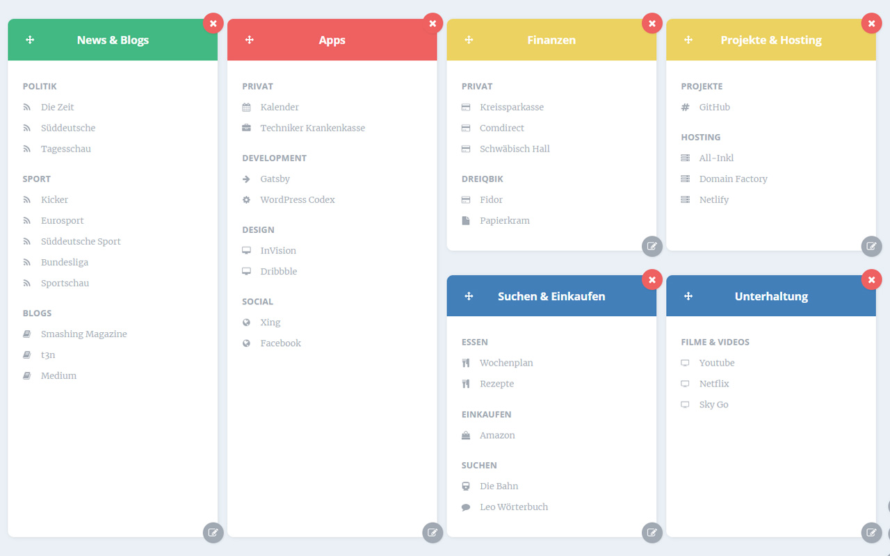

# New Tab Link Collection

This extension replaces the new tab page with a nice grid view, where you can add your favorite and most frequently used links. The grid is adjustable to your needs and you can sort your links with headings, groups, icons and colors. You can even use drag and drop to move your lists and list items around.
Check it out at: https://chrome.google.com/webstore/detail/new-tab-link-collection/gophcpnbaafonmeaekpebpdgmmfmnfep

## How it looks



## Build Setup

``` bash
# install dependencies
npm install

# serve with hot reload at localhost:8080
npm run dev

# build for production with minification
npm run build

# build for production and view the bundle analyzer report
npm run build --report
```

For a detailed explanation on how things work, check out the [guide](http://vuejs-templates.github.io/webpack/) and [docs for vue-loader](http://vuejs.github.io/vue-loader).
